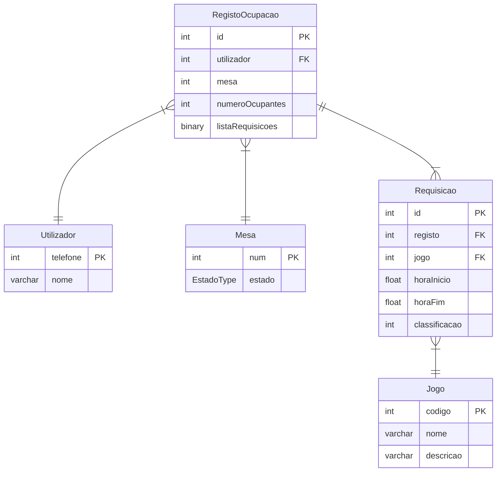

# Modelo de Dados

```mermaid
erDiagram
    RegistoOcupacao }|--|| Utilizador : ""
    RegistoOcupacao }|--|| Mesa : ""
    RegistoOcupacao ||--|{ Requisicao : ""
    Requisicao }|--|| Jogo : ""

    Jogo {
        int codigo PK
        varchar nome
        varchar descricao
    }

    RegistoOcupacao {
        int id PK
        int utilizador FK
        int mesa
        int numeroOcupantes
        binary listaRequisicoes
    }

    Requisicao {
        int id PK
        int registo FK
        int jogo FK
        float horaInicio
        float horaFim
        int classificacao
    }

    Utilizador {
        int telefone PK
        varchar nome
    }

    Mesa {
        int num PK
        EstadoType estado
    }
```
