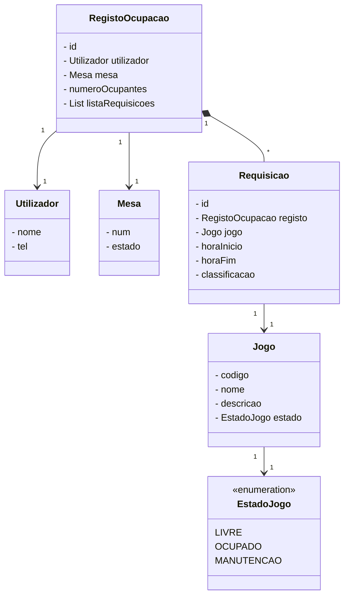
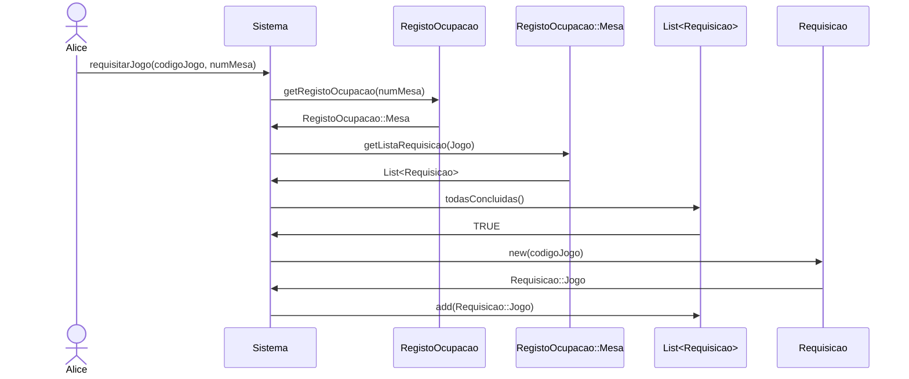

# Ex02

## Modelo Domínio

```mermaid
classDiagram
    RegistoOcupacao "1" --> "1" Utilizador
    RegistoOcupacao "1" --> "1" Mesa
    RegistoOcupacao "1" *-- "*" Requisicao
    Requisicao "1" --> "1" Jogo
    Jogo "1" --> "1" EstadoJogo

    class Utilizador {
        - nome
        - tel
    }

    class Jogo {
        - codigo
        - nome
        - descricao
        - EstadoJogo estado
    }

    class EstadoJogo {
        <<enumeration>>
        LIVRE
        OCUPADO
        MANUTENCAO
    }

    class Mesa {
        - num
        - estado
    }

    class RegistoOcupacao {
        - id
        - Utilizador utilizador
        - Mesa mesa
        - numeroOcupantes
        - List<Requisicao> listaRequisicoes
    }

    class Requisicao {
        - id
        - RegistoOcupacao registo
        - Jogo jogo
        - horaInicio
        - horaFim
        - classificacao
    }
```

## Diagrama de Interação

```mermaid
sequenceDiagram
    actor a as Alice
    participant S as Sistema
    participant RO as RegistoOcupacao
    participant ROm as RegistoOcupacao::Mesa
    participant LReq as List<Requisicao>
    participant R as Requisicao

    a->>S: requisitarJogo(codigoJogo, numMesa)
    S->>RO: getRegistoOcupacao(numMesa)
    RO->>S: RegistoOcupacao::Mesa
    S->>ROm: getListaRequisicao(Jogo)
    ROm->>S: List<Requisicao>
    S->>LReq: todasConcluidas()
    LReq->>S: TRUE

    S->>R: new(codigoJogo)
    R->>S: Requisicao::Jogo
    S->>LReq: add(Requisicao::Jogo)
```
